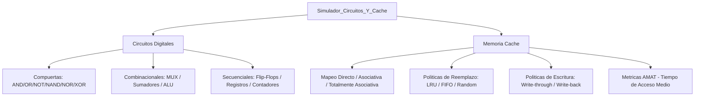

# Simulador de Circuitos Digitales y Análisis de Memoria Caché

> Simulación de circuitos digitales y análisis de diseño de jerarquía de memoria caché.

## Descripción

---

Proyecto de arquitectura de computadores que combina dos áreas fundamentales: **simulación de circuitos digitales** (compuertas lógicas, flip-flops, circuitos combinacionales y secuenciales) y **análisis de diseño de memoria caché** (jerarquía L1/L2/L3, políticas de reemplazo, modos de escritura y cálculo de tasas de acierto).

## Temas cubiertos

### Circuitos Digitales
- Compuertas lógicas: AND, OR, NOT, NAND, NOR, XOR
- Circuitos combinacionales: multiplexores, sumadores, ALU
- Circuitos secuenciales: flip-flops D/JK/T, registros, contadores

### Memoria Caché
| Parámetro | Descripción |
|---|---|
| Organización | Mapeo directo, asociativa por conjuntos, totalmente asociativa |
| Políticas de reemplazo | LRU, FIFO, Random |
| Políticas de escritura | Write-through, Write-back |
| Métricas | Hit rate, Miss penalty, AMAT |

## Arquitectura

## Contenido del repositorio

| Archivo | Descripción |
|---|---|
| `*.pdf` | Análisis completo con simulaciones y cálculos |
| `Tablas.xlsx` | Cálculos de AMAT y comparativa de políticas |

## Contexto académico

**Asignatura:** Tecnología de Computadores · **Institución:** Ingeniería Informática
**Autor:** Alejandro De Mendoza — Ingeniero Informático · Máster Arquitectura de Software

---

## Autor

**Alejandro De Mendoza**  
Ingeniero Informático · Especialista en IA · Especialista en Ingeniería de Software · Máster en Arquitectura de Software

